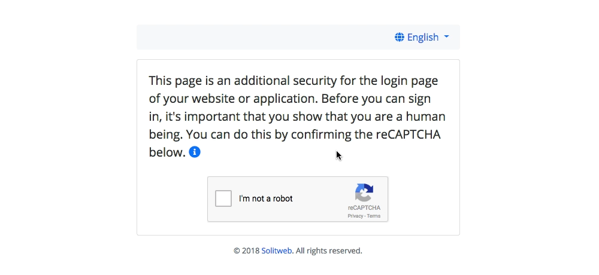

# Brute Force Protection

*This project is still in development. We are going to document how to implement on an Apache/NGINX server*



## Protect your login pages from brute force attacks.
Add an additional security for the login pages of the websites or applications hosted on your server. We do this by adding a reCAPTCHA that your users have to confirm in order to see the sign in page.

## Installation
Clone the repo:
```bash
git clone https://github/solitweb/brute-force
```
Move all the files in the `dist/` folder to a (sub)domain e.g. `burteforce.mycompany.com`. Make the `public` folder your web directory.

## Configuration
You need to copy the [config.example.php](https://github.com/solitweb/brute-force/blob/master/dist/config.example.php) (located in the `dist/` folder) to `config.php`. Next, edit the configuration variables:
```php
return [
    'title' => 'Brute Force Protection',        // Page titel
    'language_dir' => '../languages',           // Folder with language files
    'fallback_locale' => 'en',                  // The fallback locale
    'allowed_dir' => '../allowed',              // Folder with allowed IP's
    'recaptcha_sitekey' => '__SITE_KEY__',      // reCAPTCHA Site key
    'recaptcha_secretkey' => '__SECRET_KEY__',  // reCAPTCHA Secret key
    'company_name' => 'My Company',             // Your company name
    'company_url' => 'https://mycompany.com',   // Your company URL
];
```

## Generate reCAPTCHA API key
1. You must have a Google account in order to generate a reCAPTCHA API key. If you do not have one, you can [sign up](https://accounts.google.com/signup) for a new Google account.
2. Once you have your Google account ready, head over to the [Google reCAPTCHA website](https://www.google.com/recaptcha). Find and click the **Get Recaptcha** button in the upper-right corner.
3. In the **Register a new site** section:
    * Enter a label in the **Label** field.
    * Choose for a reCAPTCHA v2.
    * Enter the (sub)domain (without *http://*) e.g. `burteforce.mycompany.com` in the **Domains** textarea.
    * Accept the Terms of service.
    * Click the **Register** button.
4. You should now see your **Site key** and **Secret key**. Copy them to your `config.php` file.

## Translations
We added some languages and we are happy to receive pull requests :blush:. To add more languages, just create a new file, the filename must be a [proper language code](https://en.wikipedia.org/wiki/List_of_ISO_639-1_codes) and the file extension `.json`. For example:
* en.json
* nl.json
* fr.json
* ...

Add the template displayed here and fill in the open values:
```json
{
    "This page is an additional security for the login page of your website or application. Before you can sign in, it's important that you show that you are a human being. You can do this by confirming the reCAPTCHA below.": "",
    "Due to the ongoing bruteforce attempts on login pages, we have placed this page to protect your website or application from bruteforce attackers. A bruteforce attack means that the attacker will try every possible username and password combination to get access to the backend of your website or applicatie. We have placed this page to limit the bruteforce attacks.": "",
    "All rights reserved.": ""
}
```
Move the file to the `languages` folder. Thats it! Your file will now be recognized by the script and your language wil be available from the dropdown menu.

*To disable a language just delete the language file from the language folder.*

## Todo
- [ ] Document how to implement on a Apache/NGINX server